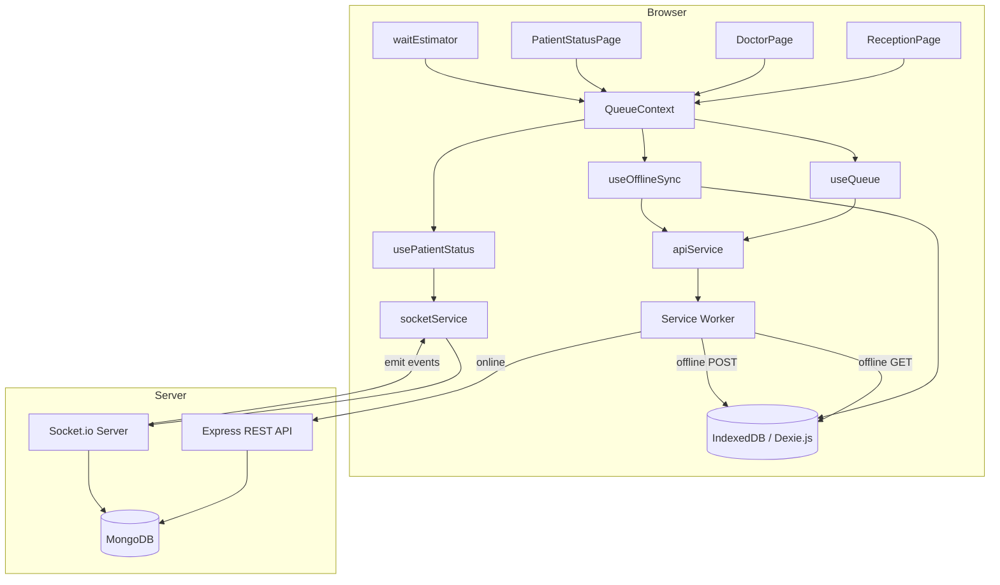

# Design Document: SWASTHYA-FLOW OPD Orchestrator

## Overview

SWASTHYA-FLOW is an Offline-First, Predictive OPD Orchestrator built as a Progressive Web App (PWA). It serves three roles — Reception, Doctor, and Patient — across a React.js frontend and a Node.js + Express backend, connected via REST APIs and Socket.io for real-time events.

The system is designed around three core principles:

1. **Offline-First**: All critical operations (token creation, queue reads) work without a network connection using IndexedDB (Dexie.js) as the local source of truth and a Service Worker for asset/response caching.
2. **Real-Time Sync**: Socket.io pushes queue state changes to all connected clients instantly when online.
3. **Predictive Wait Times**: A pure client-side `waitEstimator` function computes expected wait times using a rolling average of past consultation durations stored in the active DoctorSession.

### Technology Stack

| Layer | Technology |
|---|---|
| Frontend | React.js, Dexie.js (IndexedDB), Service Worker (Background Sync API) |
| Backend | Node.js, Express.js, MongoDB (Mongoose), Socket.io |
| Real-Time | Socket.io (server + client) |
| Offline Storage | IndexedDB via Dexie.js |
| PWA Caching | Service Worker with Cache-First + Background Sync strategies |

---

## Architecture



### Request Flow — Online

1. User action triggers a hook (`useQueue`, `useOfflineSync`)
2. Hook calls `apiService` method
3. `apiService` makes HTTP request → passes through Service Worker → hits Express API
4. Express mutates MongoDB, then emits Socket.io event
5. `socketService` receives event, updates `QueueContext` state
6. All role pages re-render with fresh queue data

### Request Flow — Offline

1. User action triggers hook
2. Hook calls `apiService` → Service Worker intercepts
3. For GET: Service Worker returns cached IndexedDB snapshot
4. For POST: Service Worker queues via Background Sync API, returns synthetic `202`; `useOfflineSync` also writes to IndexedDB with `syncStatus: "pending_sync"`
5. On reconnect: Service Worker replays queued POSTs; `useOfflineSync` replays `pending_sync` records in creation order

---

## Components and Interfaces

### Frontend Components

#### `QueueContext.js`
Global state provider. Holds the current queue array, active session, and online/offline status. All role pages consume this context. No page imports directly from another page.

```js
// Context shape
{
  queue: TokenObject[],
  session: DoctorSessionObject | null,
  isOnline: boolean,
  dispatch: Function
}
```

#### `apiService.js`
Wraps all REST calls. Returns Promises. Throws on non-2xx responses.

```js
// Interface
apiService.createToken(patientName, sessionId)   // POST /api/tokens
apiService.getQueue(sessionId)                    // GET  /api/queue/:sessionId
apiService.callNext(sessionId)                    // POST /api/sessions/:sessionId/call-next
apiService.completeConsultation(tokenId)          // POST /api/tokens/:tokenId/complete
apiService.startSession(doctorName)               // POST /api/sessions
apiService.endSession(sessionId)                  // POST /api/sessions/:sessionId/end
```

#### `socketService.js`
Manages Socket.io connection lifecycle. Supports subscribe/unsubscribe pattern. Implements exponential backoff reconnection (max 30 000 ms).

```js
// Interface
socketService.connect()
socketService.disconnect()
socketService.on(eventName, handler)
socketService.off(eventName, handler)
// Events: NEW_PATIENT_JOINED | CALL_NEXT_PATIENT | QUEUE_UPDATED | SESSION_STARTED | SESSION_ENDED
```

#### `useQueue.js`
Owned by Doctor developer. Fetches queue on mount, exposes `callNext()` and `completeConsultation(tokenId)` actions.

#### `useOfflineSync.js`
Owned by Reception developer. Wraps token creation with offline fallback. Reads `pending_sync` records from Dexie and replays them on reconnect.

#### `usePatientStatus.js`
Owned by Patient developer. Fetches a single token by `tokenId`, subscribes to `QUEUE_UPDATED` and `CALL_NEXT_PATIENT` socket events, updates local state.

#### `waitEstimator.js`
Pure function. No side effects. No imports.

```js
// Signature
function estimateWait(position, consultationDurations, windowSize = 5): number
```

#### `ReceptionPage.js` / `DoctorPage.js` / `PatientStatusPage.js`
Role-specific UI pages. Each consumes `QueueContext` and its dedicated hook. No cross-page imports.

#### Service Worker (`sw.js`)
- Cache-First for static assets
- Network-first with IndexedDB fallback for `GET /api/queue`
- Background Sync for `POST /api/tokens`
- Versioned `CACHE_NAME` constant

### Backend Components

#### Express Routes

| Method | Path | Handler | Description |
|---|---|---|---|
| POST | `/api/sessions` | `startSession` | Create a new DoctorSession |
| POST | `/api/sessions/:id/end` | `endSession` | Close a DoctorSession |
| POST | `/api/sessions/:id/call-next` | `callNext` | Call next pending token |
| GET | `/api/queue/:sessionId` | `getQueue` | Return active queue |
| POST | `/api/tokens` | `createToken` | Register patient, create token |
| POST | `/api/tokens/:id/complete` | `completeConsultation` | Mark token completed |

#### Socket.io Server
Emits events after each mutation. All events are broadcast to all connected clients (no rooms needed for MVP).

---

## Data Models

### Token (MongoDB + IndexedDB)

```ts
interface TokenObject {
  tokenId: string;          // UUID, primary key
  tokenNumber: number;      // auto-incremented per session
  patientName: string;
  status: "pending" | "called" | "completed";
  sessionId: string;        // FK → DoctorSession.sessionId
  createdAt: number;        // Unix ms
  calledAt: number | null;  // Unix ms
  completedAt: number | null; // Unix ms
  // IndexedDB only:
  syncStatus?: "synced" | "pending_sync";
}
```

### DoctorSession (MongoDB + IndexedDB)

```ts
interface DoctorSessionObject {
  sessionId: string;        // UUID, primary key
  doctorName: string;
  status: "active" | "closed";
  consultationDurations: number[]; // seconds, appended on each completion
  startedAt: number;        // Unix ms
  closedAt: number | null;  // Unix ms
}
```

### Socket.io Event Payloads

```ts
// NEW_PATIENT_JOINED
{ token: TokenObject, queue: TokenObject[] }

// CALL_NEXT_PATIENT
{ tokenId: string, tokenNumber: number, queue: TokenObject[] }

// QUEUE_UPDATED
{ queue: TokenObject[] }

// SESSION_STARTED
{ session: DoctorSessionObject }

// SESSION_ENDED
{ sessionId: string }
```

### Dexie.js Schema (IndexedDB)

```js
const db = new Dexie("SwasthyaFlowDB");
db.version(1).stores({
  tokens: "tokenId, sessionId, status, syncStatus, tokenNumber",
  sessions: "sessionId, status"
});
```

---

## Correctness Properties

*A property is a characteristic or behavior that should hold true across all valid executions of a system — essentially, a formal statement about what the system should do. Properties serve as the bridge between human-readable specifications and machine-verifiable correctness guarantees.*

### Property 1: Token creation grows the queue

*For any* active session and valid patient name, calling `createToken` should result in the queue for that session containing exactly one more token than before, with `status: "pending"`.

**Validates: Requirements 1.1, 1.5**

---

### Property 2: Offline token creation is persisted and replayed

*For any* token creation request made while offline, the request should be stored in IndexedDB with `syncStatus: "pending_sync"`, and after reconnection all such records should be replayed to the server in creation order, resulting in `syncStatus: "synced"` for each.

**Validates: Requirements 1.3, 1.4**

---

### Property 3: Queue ordering invariant

*For any* queue response from the API, all returned tokens should be ordered by `tokenNumber` ascending and none should have `status: "completed"`.

**Validates: Requirements 2.1, 2.2**

---

### Property 4: Offline queue read returns last-known state

*For any* client that has previously fetched a queue and then goes offline, requesting the queue should return the last-known snapshot from IndexedDB rather than an error.

**Validates: Requirements 2.3**

---

### Property 5: Call-next status transition

*For any* session with at least one pending token, triggering "Call Next" should transition exactly the lowest-`tokenNumber` pending token to `status: "called"` and set its `calledAt` timestamp, leaving all other tokens unchanged.

**Validates: Requirements 3.1, 3.2**

---

### Property 6: Consultation completion updates durations

*For any* token with `status: "called"`, marking it complete should set `status: "completed"`, set `completedAt`, and append `(completedAt - calledAt) / 1000` (in seconds) to the session's `consultationDurations` array.

**Validates: Requirements 3.3, 3.4**

---

### Property 7: Empty queue returns 404

*For any* session with no pending tokens, triggering "Call Next" should return a 404 response with the message `"No pending patients in queue"`.

**Validates: Requirements 3.6**

---

### Property 8: Wait estimator rolling average correctness

*For any* non-empty `consultationDurations` array of length ≥ 1 and any position `P ≥ 1`, `estimateWait(P, durations, N)` should equal `P × mean(durations.slice(-N))`.

**Validates: Requirements 5.1, 5.2, 5.3**

---

### Property 9: Wait estimator empty-durations default

*For any* position `P ≥ 1`, `estimateWait(P, [], N)` should return `P × 300`.

**Validates: Requirements 5.4**

---

### Property 10: Wait estimator round-trip consistency

*For any* non-empty `consultationDurations` array and any new duration `d`, computing the estimate before and after appending `d` should reflect the updated rolling average (i.e., the post-append estimate uses the window that includes `d`).

**Validates: Requirements 5.6**

---

### Property 11: Socket event payload shape invariant

*For any* server-side mutation that triggers a Socket.io event, the emitted payload should conform exactly to the shape defined in the event contract (Requirements 6.2–6.6) — no missing fields, no extra undocumented fields at the top level.

**Validates: Requirements 6.1, 6.2, 6.3, 6.4, 6.5, 6.6**

---

### Property 12: Reconnection backoff bound

*For any* sequence of failed reconnection attempts, the delay between attempts should never exceed 30 000 ms.

**Validates: Requirements 6.7**

---

### Property 13: Service Worker Background Sync replay

*For any* POST to `/api/tokens` made while offline, the Service Worker should return a synthetic `202` response and, upon network restoration, replay the queued request exactly once.

**Validates: Requirements 8.3, 8.4**

---

## Error Handling

### Backend

| Scenario | HTTP Status | Response Body |
|---|---|---|
| No pending patients on call-next | 404 | `{ error: "No pending patients in queue" }` |
| Token not found | 404 | `{ error: "Token not found" }` |
| Session not found | 404 | `{ error: "Session not found" }` |
| Invalid request body | 400 | `{ error: "<field> is required" }` |
| Unexpected server error | 500 | `{ error: "Internal server error" }` |

### Frontend

- `apiService` rejects with a structured error `{ status, message }` on non-2xx responses
- `useOfflineSync` catches network errors and falls back to IndexedDB write
- `socketService` catches connection errors and initiates exponential backoff reconnection
- `PatientStatusPage` shows an offline indicator banner when `isOnline === false`
- All pages display a user-friendly error state when API calls fail

---

## Testing Strategy

### Dual Testing Approach

Both unit tests and property-based tests are required. They are complementary:

- **Unit tests** cover specific examples, integration points, and error conditions
- **Property-based tests** verify universal correctness across all valid inputs

### Property-Based Testing Library

- **Frontend**: [`fast-check`](https://github.com/dubzzz/fast-check) (JavaScript/TypeScript)
- **Backend**: [`fast-check`](https://github.com/dubzzz/fast-check) (same library, Node.js)

Each property-based test must run a **minimum of 100 iterations**.

Each test must include a comment tag in the format:
```
// Feature: swasthya-flow-opd-orchestrator, Property <N>: <property_text>
```

Each correctness property must be implemented by exactly **one** property-based test.

### Unit Test Coverage

| Area | What to test |
|---|---|
| `waitEstimator.js` | Specific numeric examples, boundary at N=0, N=1, N>durations.length |
| `apiService.js` | Correct URL construction, error propagation on 4xx/5xx |
| `socketService.js` | Event subscription/unsubscription, reconnect logic |
| `useOfflineSync.js` | Pending sync write on offline, replay order on reconnect |
| Express routes | Happy path + error cases for each endpoint |
| MongoDB models | Schema validation, required fields |

### Property Test Coverage

Each property from the Correctness Properties section maps to one property-based test:

| Property | Test File | Tag |
|---|---|---|
| P1: Token creation grows queue | `tokens.property.test.js` | `Property 1` |
| P2: Offline token persisted and replayed | `offlineSync.property.test.js` | `Property 2` |
| P3: Queue ordering invariant | `queue.property.test.js` | `Property 3` |
| P4: Offline queue read | `queue.property.test.js` | `Property 4` |
| P5: Call-next status transition | `callNext.property.test.js` | `Property 5` |
| P6: Completion updates durations | `complete.property.test.js` | `Property 6` |
| P7: Empty queue 404 | `callNext.property.test.js` | `Property 7` |
| P8: Wait estimator rolling average | `waitEstimator.property.test.js` | `Property 8` |
| P9: Wait estimator empty default | `waitEstimator.property.test.js` | `Property 9` |
| P10: Wait estimator round-trip | `waitEstimator.property.test.js` | `Property 10` |
| P11: Socket payload shape | `socket.property.test.js` | `Property 11` |
| P12: Reconnection backoff bound | `socketService.property.test.js` | `Property 12` |
| P13: Background Sync replay | `serviceWorker.property.test.js` | `Property 13` |
